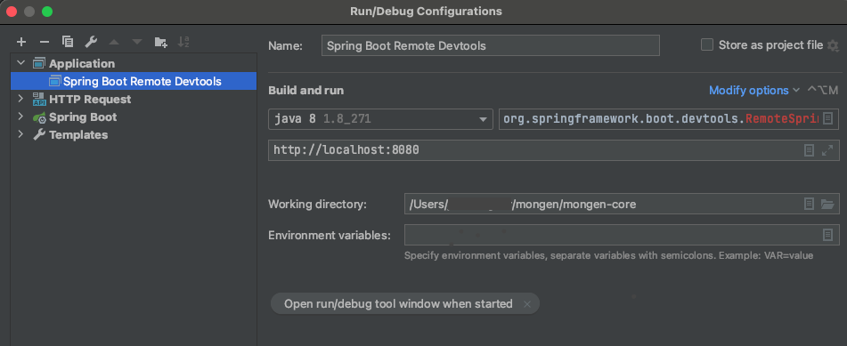
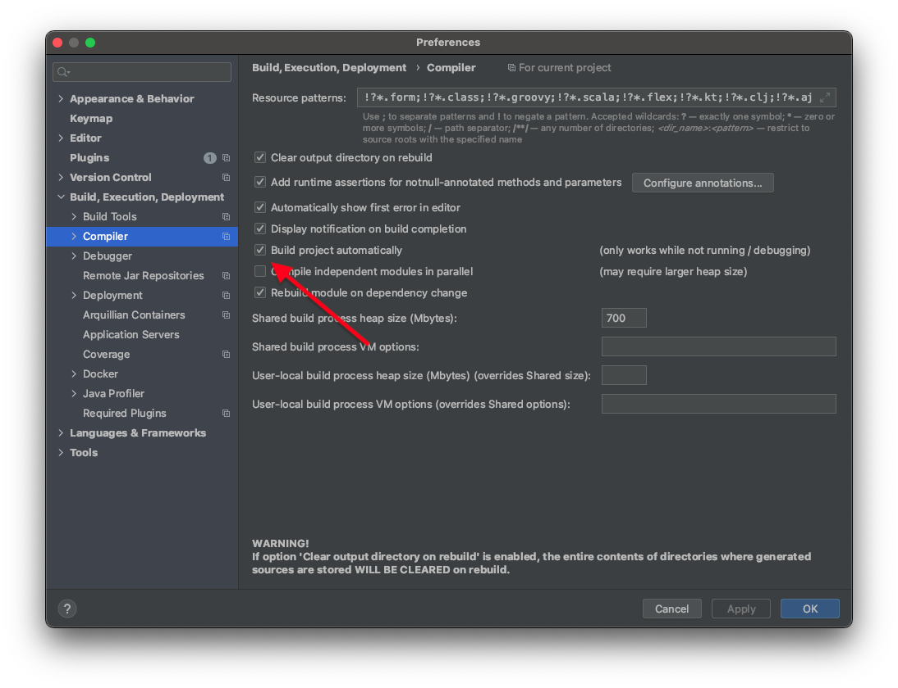
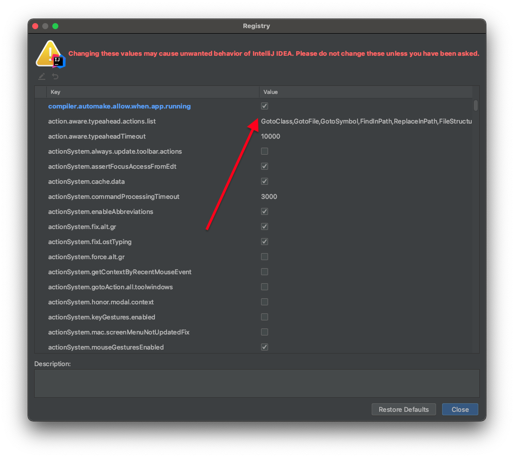
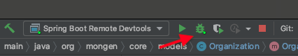

# Mongen Initiative

Connecting good people with people that needs a hand

## Start all Mongen services with Docker Compose

Clone each of the Mongen services in a folder called `mongen` in your home directory:

```
~/mongen
```

You should end with this folders:

```
mongen-core
mongen-frontend
mongen-main
mongen-media
```

Then go to `~/mongen/mongen-main/dev` and run `docker-compose up`

In order to enable remote debugging for Mongen Core service for
- IntelliJ:
  - Go to Run → Edit Configurations...
  - Create a new configuration with the + icon in the upper left corner
  - Choose Application type
  - Set `org.springframework.boot.devtools.RemoteSpringApplication` as the Main class
  - Set http://localhost:8080 to program arguments

  

  - In order to enable hot reload:
    - Go to Preferences → Build, Execution, Deployment → Compiler
    - Check the option "Build project automatically"

    

    - Apply the changes, and then press Ctrl+Shift+A (or ⌘+Shift+A on Mac) type "Registry", and once the registry window is open, locate and enable `compiler.automake.allow.when.app.running`

    

    - Then just select the `Spring Boot Remote Devtools` configuration and start debugging

    

- Eclipse:
  - Go to Run -> Run Configurations -> Java Application -> New
  - Choose `org.springframework.boot.devtools.RemoteSpringApplication` as the `main class`
  - Choose `mongen-backend` as the project
  - Set http://localhost:8080 to program arguments
